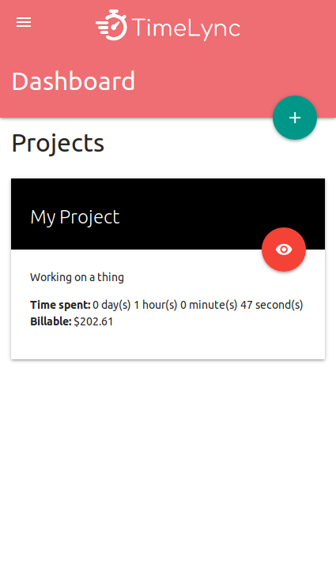

# Timelync

[Timelync.com](https://www.timelync.com)

Timelync is a Freelance management application used to track projects and billable hours.

## Screenshots

## Features

- Ability to create separate project instances for tracking
- Track billable hours in real-time by using the 'play' and 'stop' buttons
- Enter manual task hours that were not tracked in real-time
- View client bill total based on the project's billing rate amount and type settings chosen (hourly or flat rates available)
- View a historic task timeline

## Built With

- Laravel PHP framework
- Deployed on AWS using Elastic Beanstalk
